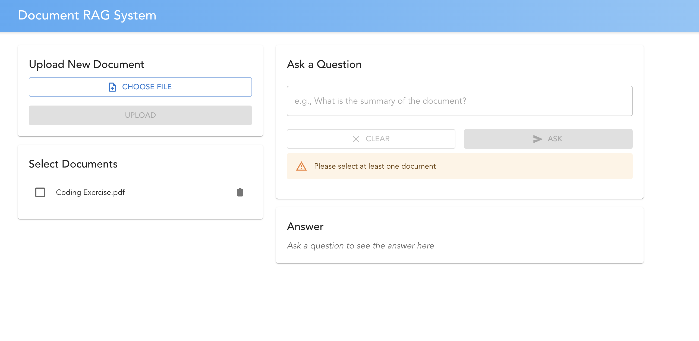
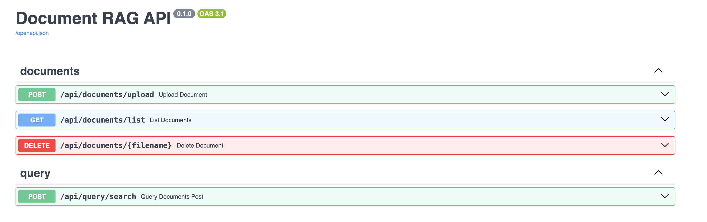

# Document RAG Application
A Retrieval Augmented Generation (RAG) system that allows users to upload documents, process them into embeddings, and ask natural language questions about their content.

## Project Overview

This application leverages the power of large language models (LLMs) and vector databases to implement a complete RAG pipeline. Users can upload documents, which are processed, chunked, and stored as vector embeddings. When users ask questions, the system retrieves the most relevant document chunks and uses an LLM to generate answers based on the context.

## Application Screenshots

### Frontend Interface

  

### Backend API

  

